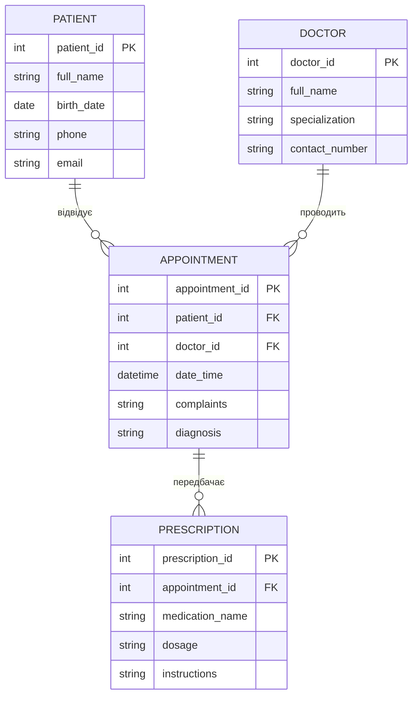

# Система лікарняних записів: облік пацієнтів, лікарів та медичних прийомів
---
## Система призначена для автоматизації обліку медичних карток пацієнтів, управління розкладом прийомів лікарів та виписаними рецептами. 

---

### Потреби зацікавлених сторін

Пацієнти:
* записуватися на прийом до лікаря
* мати історію своїх візитів (електронну медичну картку)
* отримувати інформацію про виписані рецепти та призначене лікування

Лікарі / Медичні адміністратори:
* вести базу даних пацієнтів
* управляти розкладом та реєструвати нові прийоми
* фіксувати скарги та діагнози під час огляду
* виписувати електронні рецепти на медикаменти
* переглядати історію хвороби пацієнта
---
### Система повинна зберігати:

* нформацію про пацієнтів (особисті та контактні дані)
* інформацію про лікарів та їх спеціалізацію
* інформацію про заплановані та проведені прийоми
* інформацію про рецепти на ліки, виписані за результатами прийому

---

### Бізнес-правила:

* Кожен пацієнт і лікар ідентифікуються унікальними номерами в системі.
* Один лікар може проводити безліч прийомів, але кожен конкретний прийом (запис) завжди закріплений за одним лікарем.
* Один пацієнт може мати історію з багатьох прийомів у різні дні.
* Зв'язок між пацієнтом та лікарем відбувається шляхом створення запису про прийом (Appointment) на певну дату та час.
* Під час або після прийому лікар може виписати один або декілька рецептів (Prescription).
* Факт призначення ліків фіксується створення нового запису у таблиці рецептів, який завжди прив'язується до конкретного візиту (прийому).
---
## ER-діаграма
**ER-модель складається з чотирьох сутностей:** Patient, Doctor, Appointment, Prescription.
Зв’язок між Patient та Doctor є багато-до-багатьох, який реалізується через проміжну (асоціативну) сутність Appointment. Рецепти (Prescription) є підпорядкованою сутністю до прийому.

---
## Сутності та атрибути:
### Сутність: **Patient**

| Атрибут | Опис |
| :--- | :--- |
| patient_id (PK) | Унікальний ідентифікатор пацієнта (номер електронної картки) |
| full_name | ПІБ пацієнта |
| birth_date | Дата народження |
| phone | Контактний номер телефону пацієнта | 
| email | Електронна пошта пацієнта |

### Сутність: **Doctor**

| Атрибут | Опис |
| :--- | :--- |
| doctor_id (PK) | Унікальний внутрішній ідентифікатор лікаря |
| full_name | ПІБ лікаря |
| specialization | Спеціалізація лікаря |
| contact_number | Робочий контактний телефон лікаря |

### Сутність: **Appointment**

| Атрибут | Опис |
| :--- | :--- |
| appointment_id (PK) | Унікальний ідентифікатор медичного прийому |
| patient_id (FK) | Пацієнт, який записаний на прийом |
| doctor_id (FK) | Лікар, який проводить прийом |
| date_time | Дата та час проведення прийому |
| complaints | Скарги пацієнта, зафіксовані лікарем |
| diagnosis | Встановлений діагноз (може бути порожнім до завершення огляду) |

### Сутність: **Prescription**

| Атрибут | Опис |
| :--- | :--- |
| prescription_id (PK) | Унікальний номер рецепта |
| appointment_id (FK) | Студент, який взяв книгу |
| book_id (FK) | Прийом, за результатами якого виписано рецепт |
| medication_name | medication_name |
| dosage | Дозування препарату |
| instructions | Інструкції щодо прийому препарату |

---

## Пояснення зв'язків

**Patient - Appointment**
* Тип: один-до-багатьох
* Один пацієнт може відвідувати лікарню багато разів та мати багато різних записів про прийоми.
* Кожен конкретний запис про прийом стосується виключно одного пацієнта.

**Doctor - Appointment**
* Тип: один-до-багатьох
* Один лікар може проводити багато прийомів для різних пацієнтів протягом свого робочого часу.
* Кожен запис про прийом закріплений виключно за одним лікарем..

**Appointment - Prescription**
* Тип: один-до-багатьох
* За результатами одного прийому лікар може виписати декілька різних рецептів (на кілька різних медикаментів).
* Кожен рецепт обов'язково пов'язаний з одним конкретним прийомом, під час якого він був створений.

**Patient - Doctor**
* Тип: багато-до-багатьох
* Реалізується через проміжну таблицю Appointment.
---
### *Припущення та обмеження*
*У цій версії припускається, що рецепт не може існувати сам по собі (без прив'язки до конкретного візиту/прийому). Поля complaints (скарги) та diagnosis (діагноз) в сутності Appointment можуть бути порожніми (NULL) під час створення запису на майбутній час і заповнюються лікарем безпосередньо під час візиту. Видалення запису про лікаря неможливе, якщо у нього є проведені або заплановані прийоми (обмеження зовнішнього ключа). Видалення запису про прийом (Appointment) автоматично видаляє всі пов'язані з ним рецепти (cascade delete), щоб уникнути "осиротілих" даних. Пацієнт не може бути видалений з бази, якщо у нього є збережена історія прийомів.*